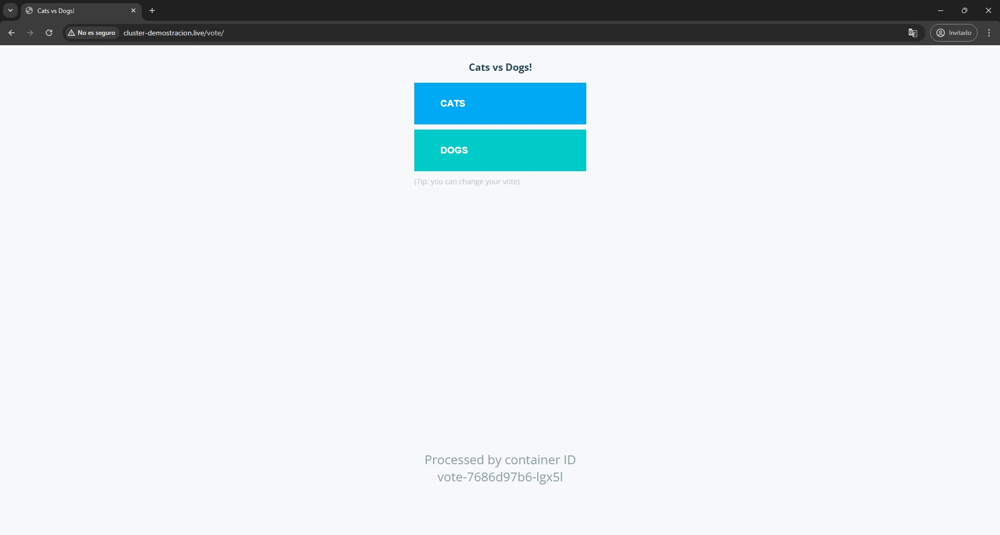

# Prueba-Dummy

## Documentación

* Implementación de Terraform: [Terraform](./documentacion/terraform.md)
* Instalación y configuración de Sonarqube: [Sonarqube](./documentacion/sonarqube.md)
* Configuración e implementación de Helm en los manifiestos: [environment](./documentacion/environment.md)

## Procedimento

### 1. Descarga los archivos del repositorio elegido.

El repostorio elegido fue [example-voting-app](https://github.com/dockersamples/example-voting-app). La descripción original de dicho proyecto se encuentra traducido al español en la carpeta `/documentacion`: [example-voting-app-original](./documentacion/example-voting-app.md).

### 2. Instala el framework necesario en caso de no tenerlo.

Los comandos necesarios para instalar todas las aplicaciones requeridas por un *agente de **linux-ubuntu*** para ejecutar el Pipeline de este proyecto se encuentran debidamente detallados en [agent-setup.sh](./agent-setup.sh). Una vez complete la ejecución de todos los comandos, debe reiniciar el agente de Azure Pipeline para asumir los cambios.

***Nota: Aunque este es un script, es recomendable que el usuario acceda a dicho archivo y ejecute cada comando de forma individual, así haya una mínima posibilidad de aparición de errores durante la ejecución del pipeline.***

### 3. Compila la aplicación luego de pasar el analisis de sonarqube.

He preparado un informe de implementación con la descripción de todo el proceso en: [SonarQube](./documentacion/sonarqube.md).

### 4. Agregar dos escenarios 

**A) Análisis fallido**

**Video demostrativo de un análisis fallido:**

https://github.com/anthonymorillo/first-filter-solved/assets/110003126/fba124e1-eb64-450c-baee-2e7be5bc1d61

**B) - Análisis exitoso**

**Video demostrativo de un análisis exitoso:**

https://github.com/anthonymorillo/first-filter-solved/assets/110003126/51309e84-4e0a-4ccc-9147-848018883bdc

### 5. Genera una imagen de docker y sube la imagen a dockerhub/ACR/ECR desde el pipeline yaml.

En el [Pipeline](./azure-pipelines.yml) se encuentra un `stage` por cada paso requerido en esta prueba, por lo que en este caso en concreto, el stage encargado de generar y subir la imagen de docker de cada una de las aplicaciones del proyecto es llamado `Build` y contiene las siguientes instrucciones:

```
# Variables: 
dockerRegistryServiceConnection: 'XXXXXXXXXXXX-XXXX-XXXX-XXXX-XXXXXXXXXXXX'
resultimage: 'votingapp-result'
voteimage: 'votingapp-vote'
workerimage: 'votingapp-worker'
containerRegistry: 'acrregistrovotingapp.azurecr.io'
resultdockerfilePath: '**/result/Dockerfile'
votedockerfilePath: '**/vote/Dockerfile'
workerdockerfilePath: '**/worker/Dockerfile'
tag: 'latest'

- stage: Build
  displayName: Paso 4 - Generacion y publicacion de imagen Docker
  dependsOn: SonarScan
  jobs:
  - job: ResultBuild
    displayName: Generando la imgen de Result App
    pool:
      name: Local-VMs
    steps:
    - task: Docker@2
      displayName: Generar y subida de la imagen de result
      inputs:
        command: buildAndPush
        repository: $(resultimage)
        dockerfile: $(resultdockerfilePath)
        containerRegistry: $(dockerRegistryServiceConnection)
        tags: |
          $(tag)

  - job: VoteBuild
    displayName: Generando la imgen de Vote App 
    pool:
      name: Local-VMs
    steps:
    - task: Docker@2
      displayName: Generar y subida de la imagen de vote
      inputs:
        command: buildAndPush
        repository: $(voteimage)
        dockerfile: $(votedockerfilePath)
        containerRegistry: $(dockerRegistryServiceConnection)
        tags: |
          $(tag)

  - job: WorkerBuild
    displayName: Generando la imgen de Worker App
    pool:
      name: Local-VMs
    steps:
    - task: Docker@2
      displayName: Generar y subida de la imagen de worker
      inputs:
        command: buildAndPush
        repository: $(workerimage)
        dockerfile: $(workerdockerfilePath)
        containerRegistry: $(dockerRegistryServiceConnection)
        tags: |
          $(tag)
    - upload: environment
      artifact: environment

```
Tal como se puede observar, el Pipeline se encarga de generar tres imagenes (`vote`,`worker` y `result`), pues el proyecto contiene 3 aplicaciones que dependen de una imagen definidas por un `Dockerfile`, cada uno se encuentra en una capeta de su respectiva aplicación, es por esto que varias de las variables declaradas son `<NombreWebApp>dockerfilePath` pues describen la ubicacion de cada uno de los `Dockerfile` y de esta forma el Pipeline puede encontrarlo y generar la imagen deseada.

Una vez generada la imagen, esta será subida a un registro de contenedores, es por ello que se declaró la variable `containerRegistry`, indicando la dirección de dicho registro al cual serán subidas las imagenes generadas. Para realizar dicho proceso se requiere de los permisos necesarios y es por esto que con la variable `dockerRegistryServiceConnection` se le asigna un hash al Pipeline con el cual puede acceder al registro de contenedores y subir imagenes allí.

Finalmente con las variables `<NombreWebApp>image` y `tag` se definen el respositorio y el tag respectivamente a los cuales serán subidas las imagenes dentro del registro, este proceso se repite tres veces, una por cada aplicación, y los resultados obtenidos fueron los siguientes:


### 6. Dentro del pipeline ejecute lo siguiente en bash o powershell. 

Para este paso fue utilizado un *task* integrado de Azure Pipelines llamado `PowerShell@2` el cual define y ejecuta un script de powershell, este puede ser un archivo o una lineas de comando escritas directamente en el pipeline.

Dado que este paso no esta relacionado con la aplicación, las tareas de parte se ejecturarán de forma paralela a los *tasks* que si guardan relación con la aplicación a desplegar, esto quiere decir que no dependerán del orden en el cual se irán ejecutando las tareas del Pipeline enfocadas en la aplicación o de si estas se ejecutan de forma correcta.

Para lograr esto, se colocó la condición `dependsOn: []` justo debajo del stage `- stage: PowershellScripting`, la cual quiere decir que esta no depende de ninguna de las demas etapas o stages del pipeline, logrando asi que se ejecute en paralelo con las demas, tal como se puede observar a continuación:


**A) Imprime Hola Mundo 10 veces en pantalla con un job paralelo**

  **Script:**
  ```
  - task: PowerShell@2
    displayName: Imprimir 10 Hola Mundo (Parte A)
    dependsOn: [] # Condicion necesaria para correr este stage como job paralelo
    inputs:
      targetType: 'inline'
      script: |
      for ($i = 1; $i -le 10; $i++) { # Bucle for para ejecutar la sentencia 10 veces
          Write-Output "Hello World" # Imprimir al usuario Hello World por i cantidad de veces
      }
      Start-Sleep -Seconds 3  # Pausa de 3 segundos para visualizar los resultados
  ```
  **Resulado obtenido:**

  

**B) Script que cree 10 archivos con la fecha y luego lo imprima en consola**

  **Script:**
  ```
  - task: PowerShell@2
      displayName: 10 archivos con la fecha (Parte B)
      inputs:
      targetType: 'inline'
      script: |
          $currentDate = Get-Date -Format "dd-MM-yyyy" # Obtiene la fecha en el formato definido
          for ($i = 1; $i -le 10; $i++) { # Bucle for para repetir una sentencia 10 veces
          $fileName = "file_$currentDate_$i.txt"     # Definir el nombre del archivo
          
          $currentDate | Out-File -FilePath $fileName    # Crear el archivo y escribir la fecha dentro de estos
          
          Write-Host -NoNewline "Se ha creado el archivo $fileName dentro se encuentra: "  # Imprimir el nombre y contenido del archivo
          Get-Content -Path $fileName             

          Start-Sleep -Milliseconds 300      # Pausar cada impresion 300 milisegundos para visualizar los resultados
          }
          Start-Sleep -Seconds 3  # Pausa de 3 segundos para visualizar todas las impresiones
  ```

   **Resulado obtenido:**

  

### 7. Despliega la app a un clúster de kubernetes (minikube o EKS o AKS)

El documento [Enviroment](./documentacion/environment.md) es un informe detallado sobre los pasos realizados para la configuración de los archivos necesarios para desplegar la aplicación en el clúster de Kubernetes.

Para implementar la aplicación al AKS se utilizó el manejador de plantillas **Helm**, por lo que la definición, instalación y actualización del despliegue de la aplicacion al AKS será llevado a cabo con dicha herramienta. Es por esto que fue necesario utilizar el *task* integrado de Azure DevOps llamado `HelmDeploy@0`.

```
variables:
  azureSubscription: 'Azure subscription 1(4)(41027952-964a-4734-9386-39c0478d52ee)'
  connectionType: 'Azure Resource Manager'
  resourceGroup: 'rg-example-voting-app'
  kubernetesCluster: 'aks-example-voting-app'
  environment: 'development'
  releaseName: 'example-voting-app'

- stage: Deploy
  displayName: Paso 6 - Despliegue de app a AKS
  dependsOn: Build
  jobs:
  - deployment: Deploy
    displayName: Despliuege de la App usando Helm
    pool:
      name: Local-VMs
    environment: 'PruebaTecnicaCGLBHD'
    strategy:
      runOnce:
        deploy:
          steps:
            - task: HelmDeploy@0
              inputs:
                connectionType: $(connectionType)
                azureSubscription: $(azureSubscription)
                azureResourceGroup: $(resourceGroup)
                kubernetesCluster: $(kubernetesCluster)
                namespace: $(environment)
                command: 'upgrade'
                chartType: 'FilePath'
                chartPath: '$(Pipeline.Workspace)/environment/$(releaseName)'
                releaseName: $(releaseName)
                waitForExecution: false
```
Este *task* a grandes rasgos ejecuta el siguiente comando: `helm upgrade --namespace development --install example-voting-app  example-voting-app --create-namespace` la cual despliega los recuros del *chart* llamado **example-voting-app** en el *namespace* **development**, siendo este un *namespace* creado para tener los recursos de esta aplicación de forma aislada, gracias a la opción `--create-namespace` este crea dicho *namespace* en caso de no existir en el clúster y luego procede con el despliegue de recursos.

La ventaja de este comando en comparacion al normalmente utilizado `helm install` es que este no actualiza las plantillas con los nuevos valores en caso de que ya exista, por lo que siempre que se realicen nuevos cambios a los *manifiestos* habría que que borrar toda la configuración actual y volver a hacer el despliegue. En el caso de `helm upgrade` esto no es necesario, pues gracias a la opción `--install` este aplica la configuración aún no haya ningún despliegue, por lo que cumple con el mismo propósito de `helm install` en caso de ser necesario.

### 8. Crea un endpoint externo accesible (ingress) para la aplicación

Dado que esta aplicación consta de dos aplicaciones web que deben de ser accesibles para el usuario, la configuración de kubernetes deben brindar la posibilidad al usuario de acceder a dos paginas web con la misma IP, pues en una de ellas colocará su voto y en la otra visualizará los resultados de los votos obtenidos hasta ese momento. 

Esto fue llevado a cabo gracias a un *manifiesto* **Ingress**, en el cual se definió un redirección basado 
la ruta ingresada por el usuario, por lo que dependiendo de la ruta que ingrese el usuario en el URL, este sera llevado a la aplicación web de resultados o de votos.

```
apiVersion: networking.k8s.io/v1
kind: Ingress
metadata:
  name: {{ .Values.appingress.ingressName }} # Nombre del ingress
  namespace: {{ .Values.environment }}
  annotations:
spec:
  ingressClassName: {{ .Values.appingress.ingressClassName }}
  rules:
  - http:
      paths:
      - path: {{ .Values.appingress.resultPath }} # Ruta predeterminada: '/' Esta dirige a 'Resultados'
        pathType: {{ .Values.appingress.pathType }} # Tipo de ruta: Prefix
        backend:
          service:
            name: {{ .Values.result.serviceName }} # Service asignado a la aplicación web de Resultados
            port:
              number: {{ .Values.result.servicePort }} # Puerto asignado a la aplicación web de Resultados
      - path: {{ .Values.appingress.votePath }} # Ruta para la aplicacion web 'Votos': '/vote'
        pathType: {{ .Values.appingress.pathType }} # Tipo de ruta: Prefix
        backend:
          service:
            name: {{ .Values.vote.serviceName }} # Service asignado a la aplicación web de Votos
            port:
              number: {{ .Values.vote.servicePort }} # Puerto asignado a la aplicación web de Votos
```

Tal como se puede observar, esta plantilla de **ingress.yaml** el Ingress de la aplicación toma de base el NGINX Controller previamente configurado y contiene dos propioedades `- path`, el primero es la ruta predeterminada '/' y esta lleva a la página de *Resultados*, por lo que con el simple hecho de ingresar el dominio web adquirido **http://cluster-demostracion.live**, este lo lleva a la pagina que se muestra a continuación:


La segunda propiedad `-path` es la ruta `/vote` y esta lleva a la pagina **Votos**, por lo que al colocar el URL **http://cluster-demostracion.live/vote**, este lleva a la pagina en la cual se puede realizar la votación, tal como se muestra a continuación:



### 9. Sube al repo en una carpeta environment todos los yaml de k8s

En la carpeta `environment` se encuentra el *chart* de Helm creado para este proyecto llamado **example-voting-app**, por lo que allí se encuentran todos los archivos necesarios para desplegar este proyecto, tal como se muestra a continuación:

```
📦environment
 ┗ 📂example-voting-app
   ┣ 📂templates
   ┃ ┣ 📜_helpers.tpl
   ┃ ┣ 📜deployment.yaml
   ┃ ┣ 📜ingress.yaml
   ┃ ┣ 📜service.yaml
   ┃ ┗ 📜_helpers.tpl
   ┣ 📜.helmignore
   ┣ 📜Chart.yaml
   ┗ 📜values.yaml
```
### Resultados del Pipeline:

Estos son los reultados luego de correr el Pipeline con el código fuente ubicado en este proyecto:


## Que se espera del ejercicio

- [x] **Configuración de la infraestructura desde cero.** *(Informe detallado de los pasos seguidos para la configuración de la infraestructura en: [Terraform](./documentacion/Terraform.md))*

- [x] **Documentación para crear solución y demostración de la aplicación funcionando.**

- [x] **Coding Standards.** *(Se hizo especial énfasis en los siguientes puntos: Ninguna de las variables se encuentran hardcoded, todos los bloque de código desarrollados fueron debidamente comentados y documentados, se optó por la modularidad siempre que fue posible, las variables se encuentran nombradas coherentemente y el formato utilizado es constante y entendible)*

- [x] **Enfoque hacia la meta.**

## Bonus para tomar en consideración

- [x] **Construye un clúster de kubernetes usando IaC (terraform o eksctl)**: *(Archivos de configuración de **Terraform** se encuentran en [terraform](/example-voting-app/terraform/))*

- [x] **Usa un manejador de templates como Kustomize o Helm.** *(Para el desarrollo de esta prueba fue utilizado **Helm**, los archivos necesarios se encuentran en [environment/example-voting-app](/example-voting-app/environment/example-voting-app/))*

- [x] **Despliega en nube publica (AWS o Azure).** *(Todo el proyecto fue desplegado en **Azure**)*

- [x] **Que sea accesible desde internet.**

**Video demostrativo del acceso a la aplicación desde un celular:**

https://github.com/anthonymorillo/first-filter-solved/assets/110003126/a9a04217-d3c3-480e-9404-6959c6e6b6e2

- [x] **Uso de metodologías DevOps.**

## Resultados que debes adjuntar

- [x] Codigo

- [x] yaml de k8s (Ubicación: [environment](/example-voting-app/environment/))

- [x] Pipelines (Ubicación: [pipeline](/example-voting-app/azure-pipelines.yml))

- [x] Logs

- [x] Printscreen

- [x] Recording de pantalla (opcional)

- [x] Compartir repositorio de github publico para evaluación
