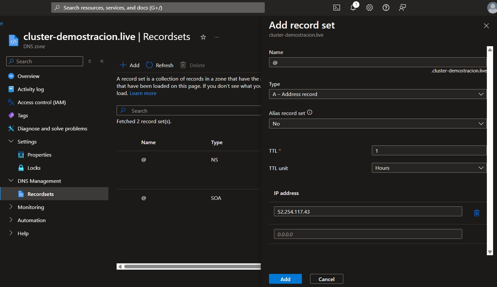
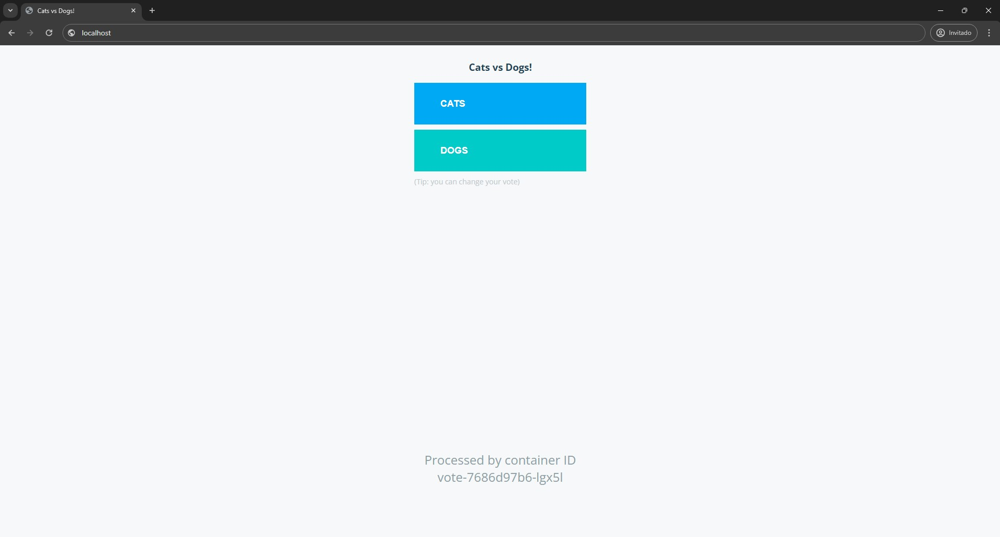
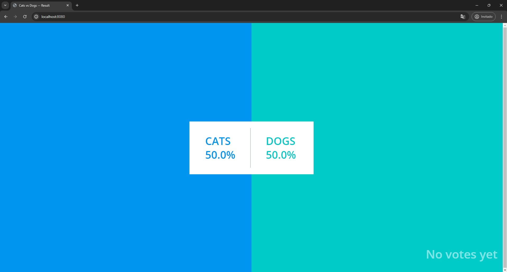

# Despliegue de app a Kubernetes

## Introducción

Al haber desplegado los recursos declarados en los archivos de *Terraform* ubicados en [/terraform](../terraform/), ya se cuenta con la infraestructura de nube necesaria para el desarrollo de este proyecto, por lo que solo resta desplegar la aplicación deseada en dichos recursos.

## Procedimiento

1. Una vez dentro del *tenant* en el cual se encuentra el AKS, se debe establecer la suscripción en la cual el clúster fue creado, para ello se utiliza el comando `az account set` indicando el ID de las suscripción deseada.

```
az account set --subscription XXXXXXXXX-XXX-XXXXX-XXXXXXX-XXXXXXXX
```

2. Luego de esto se debe obtener las credenciales de acceso del AKS, por lo que se utiliza el comando `az aks get-credentials`

```
az aks get-credentials --resource-group rg-example-voting-app --name aks-example-voting-app --overwrite-existing
```

3. Por defecto los clúster AKS no tienen ninguna forma de direccionar tráfico desde fuera del internet hacia sus servicios, por lo que se implementó un *INGRESS CONTROLLER* para que este haga el balanceo de carga entre los distintos servicios alojados en el AKS y redireccione el tráfico de acuerdo con las peticiones del cliente. El seleccionado en este caso fue el **NGINX CONTROLLER** por lo que fue necesario instalar el mismo con el siguiente comando: 
```
helm upgrade --install ingress-nginx ingress-nginx --repo https://kubernetes.github.io/ingress-nginx --namespace ingress-nginx --create-namespace
```
4. Se debe confirmar que el *NGINX INGRESS* esta debidamente configurado, visualizar su IP pública y validar que sus pods estan trabajando de forma correcta con el comando `kubectl get pods,svc -n ingress-nginx` especificamndo en *namespace* **ingress-nginx**.

```
> kubectl get pods,svc -n ingress-nginx

NAMESPACE       NAME                                            READY   STATUS    RESTARTS   AGE
ingress-nginx   pod/ingress-nginx-controller-6dfcb8658d-fn92m   1/1     Running   0          19m

NAMESPACE       NAME                                         TYPE           CLUSTER-IP     EXTERNAL-IP     PORT(S)                      AGE
ingress-nginx   service/ingress-nginx-controller             LoadBalancer   10.0.65.186    52.254.117.43   80:30603/TCP,443:32403/TCP   19m
ingress-nginx   service/ingress-nginx-controller-admission   ClusterIP      10.0.222.49    <none>          443/TCP                      19m
```

5. Previamente he adquirido el dominio **cluster-demostracion.live** para el desarrollo de este proyecto, por lo que este debe ser asignado a la IP Externa del NGINX INGRESS previamente configurado, para ello hay que dirigirse al DNS Zone previamente creado y se crea nuevo *RecordSet* tipo **A** con el nombre **@** y que apunte a la IP Externa del NGINX INGRESS, tal como se muestra a continuación:




6. Luego de esto se procede a crear un *chart* en la carpeta `environment` del proyecto con el comando `helm create <NombredelProjecto>`, este comando crea un directorio con todos los archivos necesarios por *Helm* para desplegar recursos al clúster:

```
> helm create example-voting-app
Creating example-voting-app
```

7. Teniendo el directorio listo, se procedió a convertir los *manifiestos* ubicados en la carpeta `k8s-specifications` que trae el proyecto de forma predeterminada. Dicha carpeta trae los siguientes archivos:

```
📦k8s-specifications
 ┣ 📜db-deployment.yaml
 ┣ 📜db-service.yaml
 ┣ 📜redis-deployment.yaml
 ┣ 📜redis-service.yaml
 ┣ 📜result-deployment.yaml
 ┣ 📜result-service.yaml
 ┣ 📜vote-deployment.yaml
 ┣ 📜vote-service.yaml
 ┗ 📜worker-deployment.yaml
```

8. Dado que los *manifiestos* necesarios para este proyecto solo son **deployment** y **service**, se crearon los *templates* llamados **deployment.yaml** y **service.yaml** en los cuales llevados todos los manifiestos de un mismo tipo a su *template* correspondiente, ademas de asignarle variables a cada campo, un ejemplo de esto es:
<center>

| <center>db-service.yaml</center>   | <center>service.yalm</center> |
| -------- | ----------- |
| apiVersion: v1<br>kind: Service<br>metadata:<br>&nbsp;&nbsp;&nbsp;labels:<br>&nbsp;&nbsp;&nbsp;&nbsp;&nbsp;&nbsp;app: db<br>&nbsp;&nbsp;&nbsp;name: db<br>spec:<br>&nbsp;&nbsp;&nbsp;type: ClusterIP<br>&nbsp;&nbsp;&nbsp;&nbsp;&nbsp;&nbsp;ports:<br>&nbsp;&nbsp;&nbsp;- name: "db-service"<br>&nbsp;&nbsp;&nbsp;&nbsp;&nbsp;&nbsp;port: 5432<br>&nbsp;&nbsp;&nbsp;&nbsp;&nbsp;&nbsp;targetPort: 5432<br>&nbsp;&nbsp;&nbsp;selector:<br>&nbsp;&nbsp;&nbsp;&nbsp;&nbsp;&nbsp;app: db | apiVersion: v1<br>kind: Service<br>metadata:<br>&nbsp;&nbsp;&nbsp;labels:<br>&nbsp;&nbsp;&nbsp;&nbsp;&nbsp;&nbsp;app: {{ .Values.db.appName }}<br>&nbsp;&nbsp;&nbsp;name: {{ .Values.db.serviceName }}<br>&nbsp;&nbsp;&nbsp;namespace: {{ .Values.environment }}<br>spec:<br>&nbsp;&nbsp;&nbsp;type: {{ .Values.db.serviceType }}<br>&nbsp;&nbsp;&nbsp;&nbsp;&nbsp;&nbsp;ports:<br>&nbsp;&nbsp;&nbsp;- name: {{ .Values.db.servicePortName }}<br>&nbsp;&nbsp;&nbsp;&nbsp;&nbsp;&nbsp;port: {{ .Values.db.servicePort }}<br>&nbsp;&nbsp;&nbsp;&nbsp;&nbsp;&nbsp;targetPort: {{ .Values.db.targetServicePort }}<br>&nbsp;&nbsp;&nbsp;selector:<br>&nbsp;&nbsp;&nbsp;&nbsp;&nbsp;&nbsp;app: {{ .Values.db.appName }}

</center>


9. Luego se asignan los valores correspondientes en el `values.yaml` a cada una de las variables previamente declaradas de la siguiente forma :

```
replicaCount: 1
environment: development

db:
  appName: db
  # Variables para el Deployment
  nameDeployment: db
  repository: postgres
  tag: 15-alpine
  containerName: postgres
  containerPort: 5432
  containerPortName: postgres
  mountPath: /var/lib/postgresql/data
  volumeName: db-data
  # Variables para el Service
  serviceName: db
  serviceType: ClusterIP
  servicePortName: db
  servicePort: 5432
  targetServicePort: 5432
```

10. Tal como se puede observar, con la implementación de Helm se le asigno una nueva propiedad a los manifiestos que fue *namespace* con el valor de **development**, de esta forma los recursos perteneceran a un ambiente distinto al determinado y aislandolos totalmente de otros recursos que no formen parte de la aplicación.

11. Dentro de la carpeta `/environment` se ejecuta el comando `helm upgrade --namespace development --install example-voting-app  example-voting-app --create-namespace` para asi instalar un nuevo *release* de *Helm* con los valores especificados.
```
> helm upgrade --namespace development --install example-voting-app  example-voting-app --create-namespace
Release "example-voting-app" has been upgraded. Happy Helming!
NAME: example-voting-app
LAST DEPLOYED: Sun Jun  9 16:01:15 2024
NAMESPACE: development
STATUS: deployed
REVISION: 1
TEST SUITE: None
```

12. Luego de esto se verifican si los recursos fueron correctamente desplegados con el comando `kubectl get all --all-namespaces`.

```
> kubectl get all --all-namespaces
NAMESPACE       NAME                           READY   STATUS    RESTARTS   AGE
development     pod/db-95fd75546-8zq7g         1/1     Running   0          72s
development     pod/redis-77fccb7f9-7k9rp      1/1     Running   0          72s
development     pod/result-7c54bbbc5b-r6k8n    1/1     Running   0          72s
development     pod/vote-7686d97b6-jt7x7       1/1     Running   0          72s
development     pod/worker-f9dc656c9-qbns8     1/1     Running   0          72s

NAMESPACE       NAME                           TYPE           CLUSTER-IP     EXTERNAL-IP     PORT(S)           AGE
default         service/kubernetes             ClusterIP      10.0.0.1       <none>          443/TCP           39h
development     service/db                     ClusterIP      10.0.61.11     <none>          5432/TCP          73s
development     service/redis                  ClusterIP      10.0.139.182   <none>          6379/TCP          73s
development     service/result                 NodePort       10.0.100.190   <none>          5001:31001/TCP    73s
development     service/vote                   NodePort       10.0.52.204    <none>          5000:31000/TCP    72s

NAMESPACE       NAME                           READY   UP-TO-DATE   AVAILABLE   AGE
development     deployment.apps/db             1/1     1            1           72s
development     deployment.apps/redis          1/1     1            1           72s
development     deployment.apps/result         1/1     1            1           72s
development     deployment.apps/vote           1/1     1            1           72s
development     deployment.apps/worker         1/1     1            1           72s

NAMESPACE       NAME                               DESIRED   CURRENT   READY   AGE
development     replicaset.apps/db-95fd75546       1         1         1       72s
development     replicaset.apps/redis-77fccb7f9    1         1         1       72s
development     replicaset.apps/result-7c54bbbc5b  1         1         1       72s
development     replicaset.apps/vote-7686d97b6     1         1         1       72s
development     replicaset.apps/worker-f9dc656c9   1         1         1       72s
```

13. Tal como puede observar, todos los recursos fueron debidamente desplegados y se encuentran en *estado* de **Running**, por lo que procedemos a validar si los recursos tienen una correcta comunicación entre ellos, por lo que accedemos a los *logs* de los pods las dos aplicaciones web `vote` y `result` para validar que `vote` se comunique correctamente con el `worker` y que `result` se comunique con `db`. Para ello se utilizo el comando `kubectl logs <nombre-del-pod> -n development`.

```
> kubectl logs vote-7686d97b6-jt7x7 -n development
[2024-06-09 20:01:50 +0000] [1] [INFO] Starting gunicorn 22.0.0
[2024-06-09 20:01:50 +0000] [1] [INFO] Listening at: http://0.0.0.0:80 (1)
[2024-06-09 20:01:50 +0000] [1] [INFO] Using worker: sync
[2024-06-09 20:01:50 +0000] [7] [INFO] Booting worker with pid: 7
[2024-06-09 20:01:50 +0000] [8] [INFO] Booting worker with pid: 8
[2024-06-09 20:01:50 +0000] [9] [INFO] Booting worker with pid: 9
[2024-06-09 20:01:50 +0000] [10] [INFO] Booting worker with pid: 10


> kubectl logs result-7c54bbbc5b-r6k8n -n development
Sun, 09 Jun 2024 20:01:50 GMT body-parser deprecated undefined extended: provide extended option at server.js:67:17
App running on port 80
Waiting for db
Waiting for db
Connected to db
```

14. Gracias a los *logs* se puede determinar que los pods se estan comunicando correctamente entre sí, por lo que hay que acceder a lo mismos y validar que funcionen correctamente. Para ello se van a acceder localmente, para ello se realiza un **port-forward** y de esta forma se mapean el puerto del servicio del pod a uno local de la siguiente forma:

```
> kubectl port-forward service/result 8080:5001 -n development
Forwarding from 127.0.0.1:8080 -> 80
Forwarding from [::1]:8080 -> 80
Handling connection for 8080


> kubectl port-forward service/vote 80:5000 -n development
Forwarding from 127.0.0.1:80 -> 80
Forwarding from [::1]:80 -> 80
Handling connection for 80
```

**service/vote con redireccionamiento de puerto:**



**service/result con redireccionamiento de puerto:**




15. Luego de esto se creó un **Ingress** para administrar el tráfico proveniente de internet y dar acceso a los servicios dependiendo de ciertas condiciones. Este es el encargado de permitir que los usuarios accedan a la aplicación desde el internet, por lo que es quien posee la IP externa proveniente del NGINX INGRESS.

```
apiVersion: networking.k8s.io/v1
kind: Ingress
metadata:
  name: {{ .Values.appingress.ingressName }}
  namespace: {{ .Values.environment }}
  annotations:
spec:
  ingressClassName: {{ .Values.appingress.ingressClassName }}
  rules:
  - http:
      paths:
      - path: {{ .Values.appingress.resultPath }}
        pathType: {{ .Values.appingress.pathType }}
        backend:
          service:
            name: {{ .Values.result.serviceName }}
            port:
              number: {{ .Values.result.servicePort }}
      - path: {{ .Values.appingress.votePath }}
        pathType: {{ .Values.appingress.pathType }}
        backend:
          service:
            name: {{ .Values.vote.serviceName }}
            port:
              number: {{ .Values.vote.servicePort }}
```

15. Todo esto fue lo necesario para la configuración general del proyecto, por lo que los resultados y demas puntos importantes se encuentran en el `README.md` ubicado en el *root* folder del proyecto.
