# Implementación de SonarQube

## Introducción
Para asegurar la continua inspección de la calidad del código fue implementado SonarQube, la cual es una herramienta open-source que brinda al usuario un reporte de la calidad del codigo. Esta herramienta es sumamente ventajosa pues es capaz de integrarse con plataformas de DevOps como Azure DevOps, permitiendo así analizar el código siempre que este sufra algún tipo de cambio y formando así parte del Pipeline perteneciente a la aplicación.

Dado que el análisis del código forma parte del Pipeline, SonarQube tiene que ser configurado en el agente que procesa las tareas de dicho Pipeline. Por lo que los programas y archivos deben de encontrarse en el cliente antes de proceder con la implementación.

## Procedimiento

1. Para la implementación de Sonarqube el primer paso es descargar la imagen oficial de esta que se encuentra en el registro público Docker Hub y solo basta con correr el comando `docker pull sonarqube` para descargar la imagen oficial del mismo.

```
$ docker pull sonarqube
Using default tag: latest
latest: Pulling from library/sonarqube
. . .
Status: Downloaded newer image for sonarqube:latest
docker.io/library/sonarqube:latest
```

2. Ya que SonarQube es una aplicación de reportes, esta necesita e una base de datos para sus operaciones, por lo que se debe de iniciar un contenedor, en este caso especificamente *postgres:alpine*.

```
~$ docker run -d --name sonarqube-db -e POSTGRES_USER=sonar -e POSRTGRES_PASSWORD=sonar -e POSTGRES_DB=sonarqube postgres:alpine
Unable to find image 'postgres:alpine' locally
alpine: Pulling from library/postgres
. . .
Status: Downloaded newer image for postgres:alpine
a249a051fc936ff79eadfe0140e2c126207d2476b79ad3783aab25a7f02943ae
```

3. En este punto al subir el contenedor de SonarQube este se detenia y al correr docker `docker logs sonarqube` pude ver los logs del contenedor:

```
[1] bootstrap checks failed. You must address the points described in the following [1] lines before starting Elasticsearch. For more information see [https://www.elastic.co/guide/en/elasticsearch/reference/8.11/bootstrap-checks.html]
```

4. Pude ver que estaba dando error por una baja asignacion de memoria virtual, por lo que tuve que acceder al archivo: `/etc/sysctl.conf`, allí le añadi una linea `vm.max_map_count=262144`, procedí a reiniar el equipo, ejecuté el comando `docker ps` y pude ver que el contenedor corría de forma correcta.

```
$ docker ps
CONTAINER ID   IMAGE             COMMAND                  CREATED          STATUS              PORTS                                       NAMES
77d2717ee006   sonarqube         "/opt/sonarqube/dock…"   49 minutes ago   Up About a minute   0.0.0.0:9000->9000/tcp, :::9000->9000/tcp   sonarqube
e6f0a651bc0d   postgres:alpine   "docker-entrypoint.s…"   50 minutes ago   Up 9 minutes        5432/tcp                                    sonarqube-db
```

5. Desde un navegador dentro del agente, viste el `localhost:9000` para de estar forma acceder al servidor web de SonarQube:

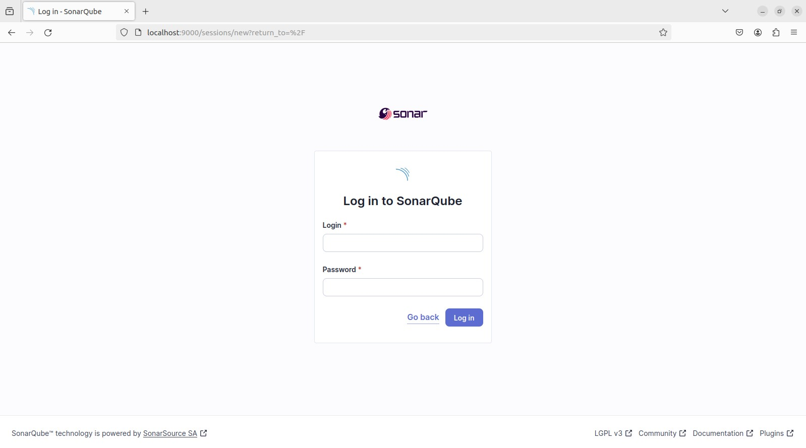

6. Los valores por defecto para acceder inicialmente al servidor tanto del user como el password son **admin**, luego de esto, el servidor solicita al usuario cambiar la contraseña por la de su preferencia. Una vez cambiada la contraseña, se puede visualizar la pantalla de inicio.

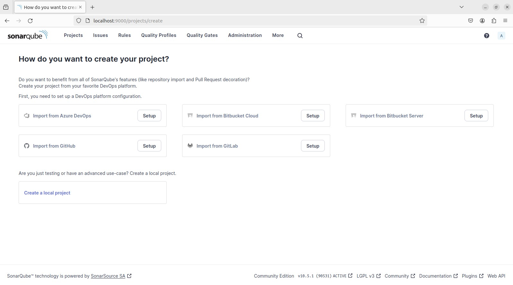

7. En este caso, se importaría el proyecto desde Azure DevOps en donde es necesario proveer un nombre para la configuración, el URL de la organización de Azure DevOps y finalmente un PAT de acceso a la organización. 

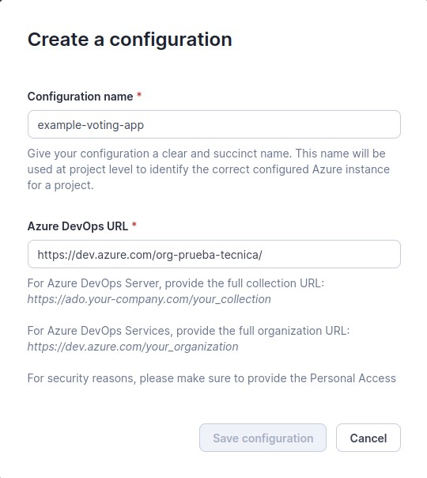

8. Para la generación del PAT en Azure DevOps es necesario dirigirse a las configuraciones de usuario y seleccionar Personal Access Tokens, allí se crea un token por el tiempo deseado y especificamente con el permiso de **Code > Read, Write & Manage**

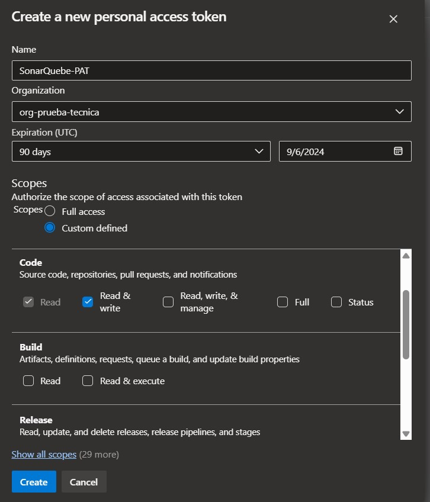

9. Ya con esto sera suficiente para visualizar los proyectos alojados dentro de la organización, como es en este caso *example-voting-app*.

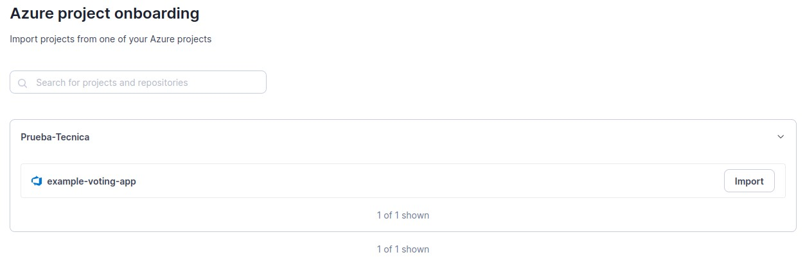

10. Luego de esto, el servidor muestra las distintas formas en la que puede analizar el código, en esta caso sería con Azure Pipelines.

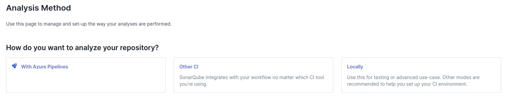

11. Para continuar con la configuración es necesario instalar una extensión de SonarQube para Azure DevOps.

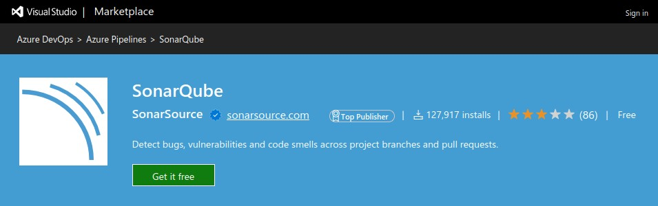

13. Luego de esto es necesario generar un token de acceso para Azure DevOps en Sonarqube.

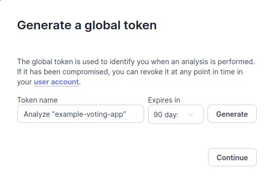

14. Del lado de Azure DevOps se debe crear un service connection que permita a Sonarqube a acceder el proyecto alojado en Azure Repo, allí en el apartado de `token` se coloca el PAT generado por Sonarqube.

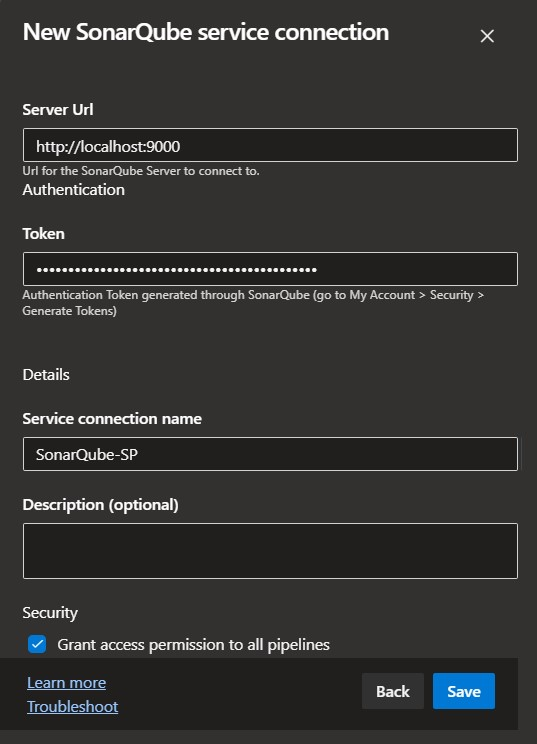

15. Luego de esto se prepara la configuración de análisis.

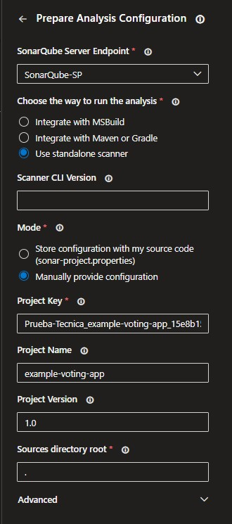

15. Luego de esto se establece la version de JAVA en la que correrá el servicio de Análisis de código.

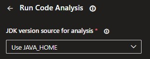

16. Finalmente el tiempo de demora máximo que podrá demorar el proceso de análisis.

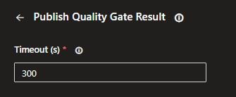

17. Para probar la herramienta se llevó a cabo un análisis exitoso y otro fallido.

**Análisis exitoso:**
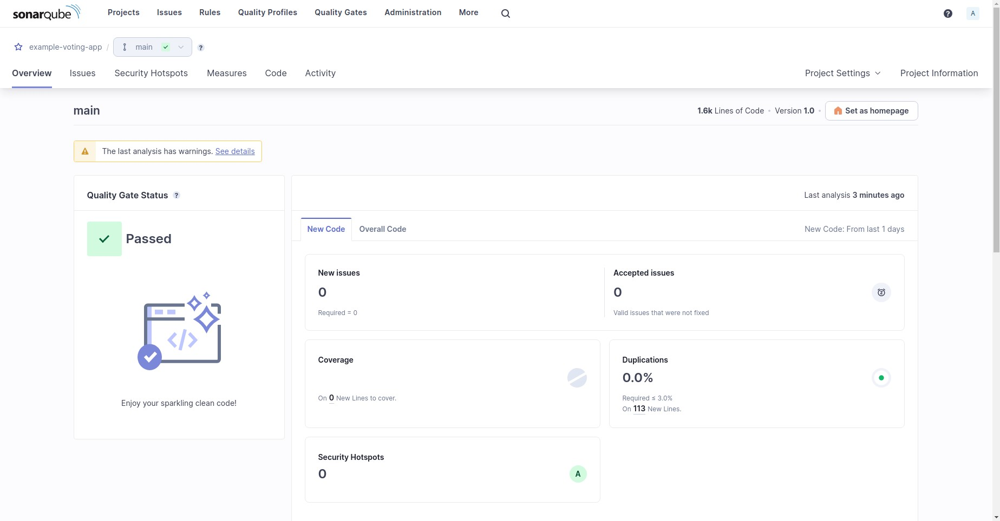

**Análisis fallido:**
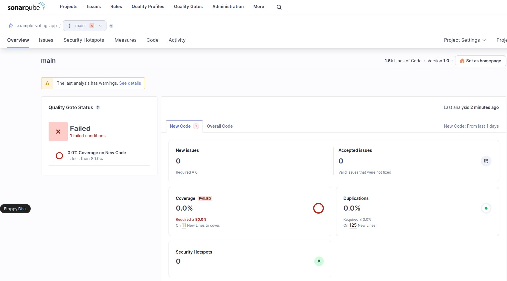